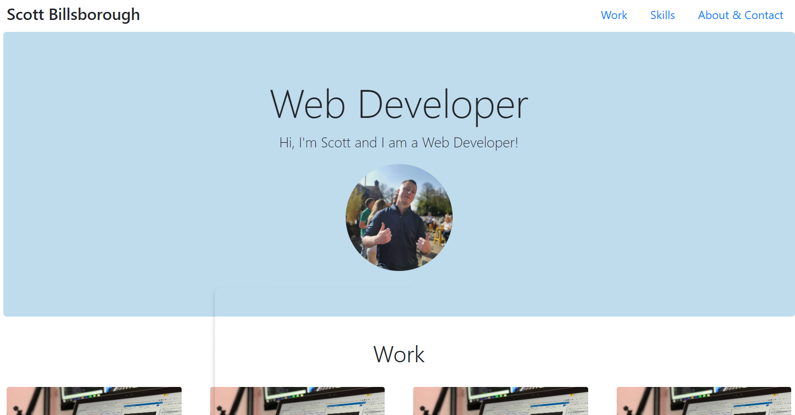

# Bootstrap Portfolio

A portfolio site using Bootstrap.

## Table of contents

- [General info](#general-info)
- [Screenshots](#screenshots)
- [Technologies](#technologies)
- [Setup](#setup)
- [Live Application](#live-application)
- [Features](#features)
- [Status](#status)
- [Contact](#contact)

## General info

Made to practise building a site with Bootstrap.

## Screenshots

## Technologies

- HTML
- CSS
- Bootstrap

## Setup

Open the index.html in any modern browser.

## Live Application

https://sbillsborough.github.io/portfolio-site

## Features

List of features ready and TODOs for future development

- Responsive
- Links to page sections
- Hover effects on work cards and footer links

To-do list:

- Add projects to work cards as they're completed

## Status

Project is: _in progress_

## Contact

Created by [billsboroughscott@gmail.com] - feel free to contact me!
